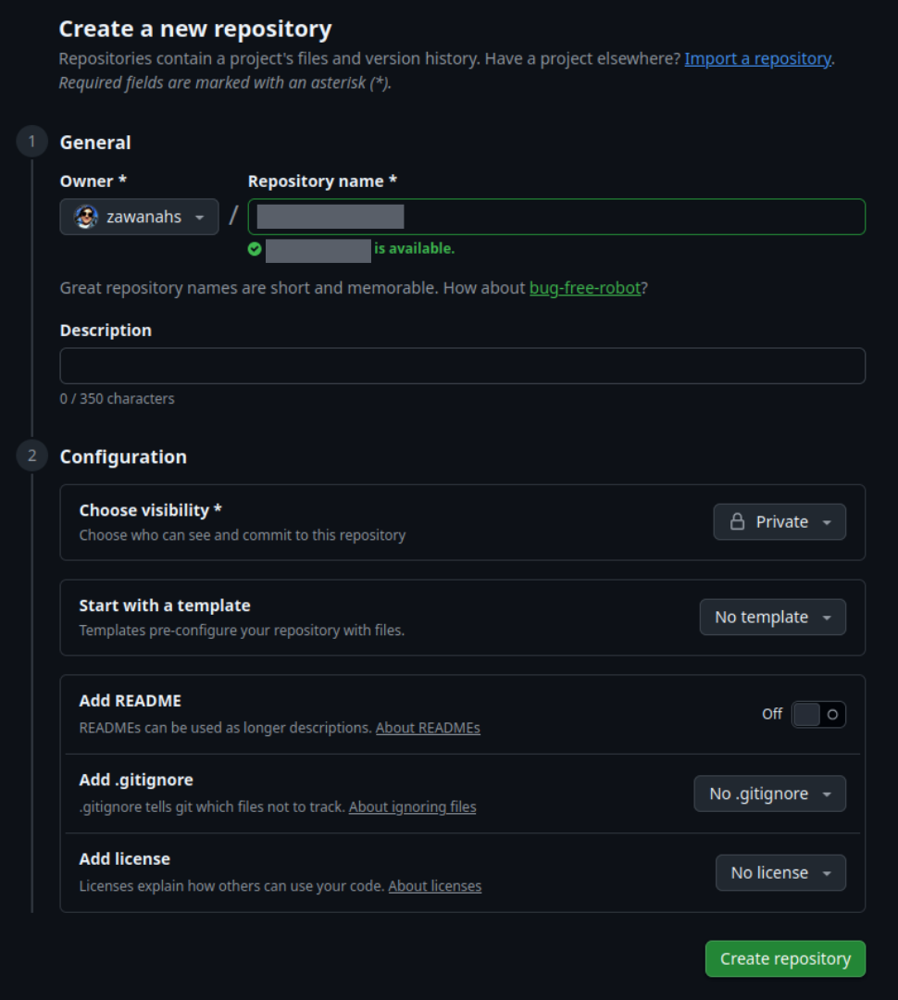
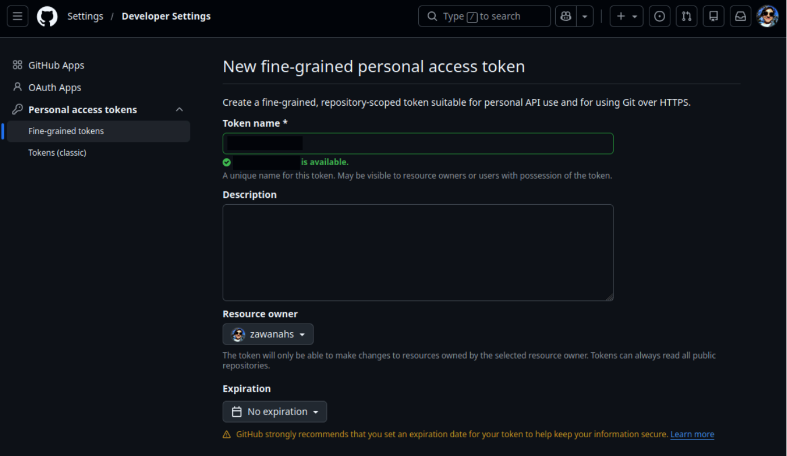
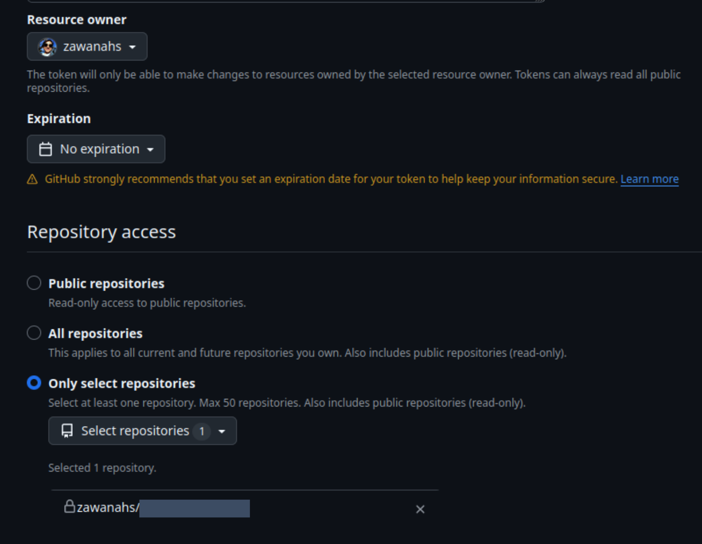
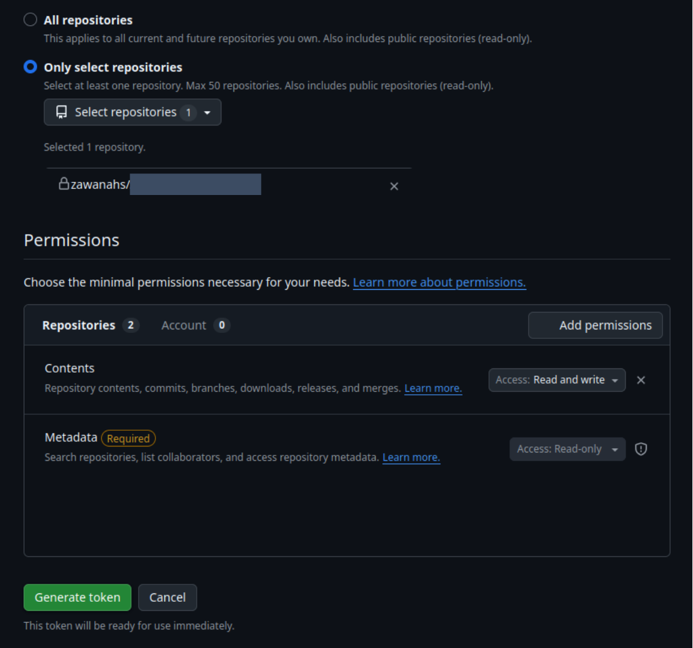
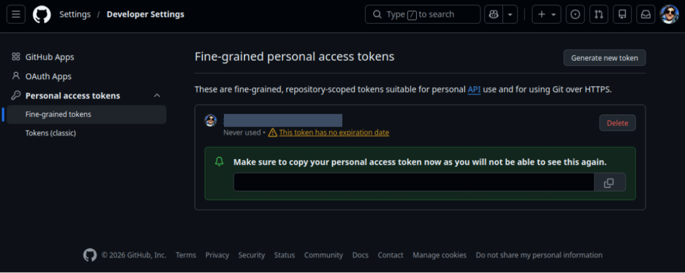
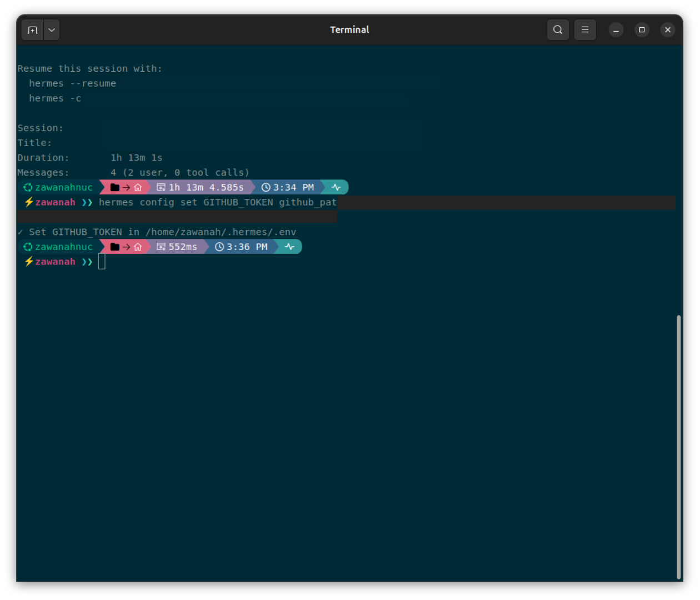
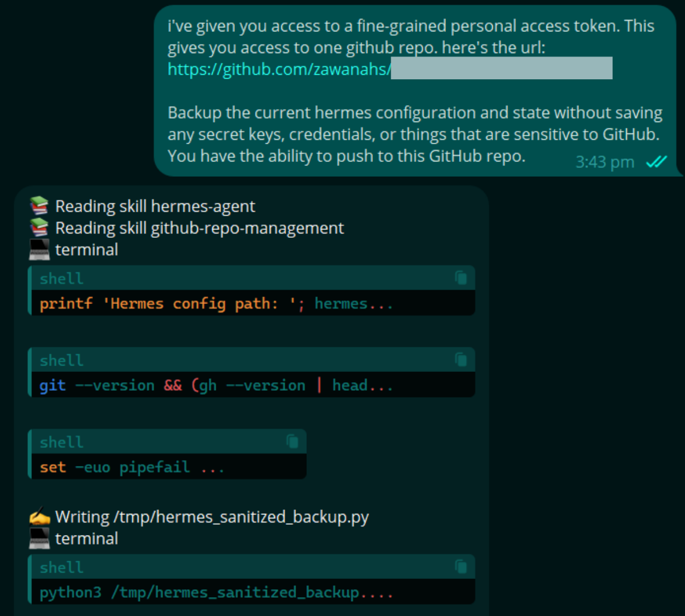
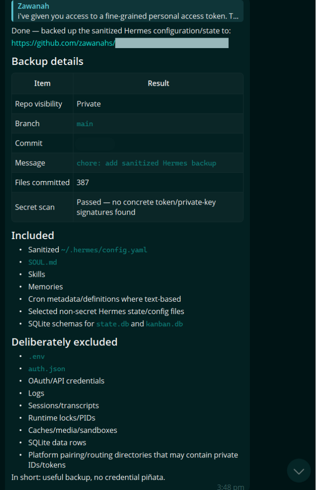
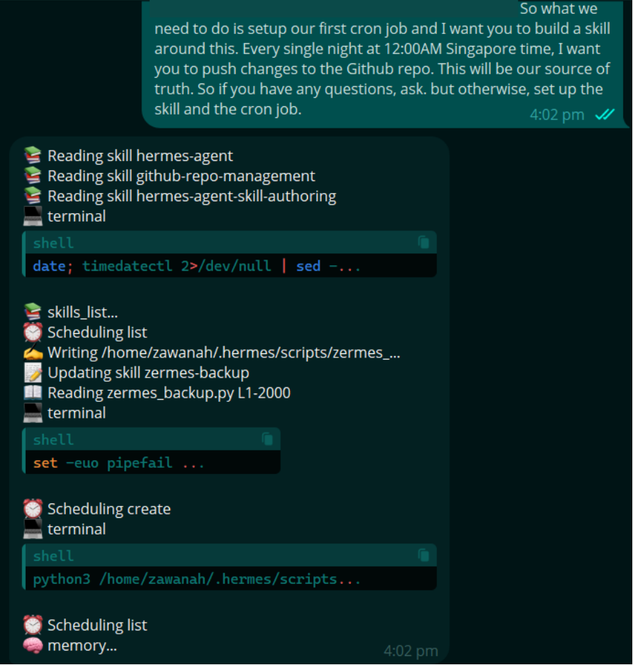

The more I chat with my Hermes agent, the more valuable it becomes as I customise its personality, install skills, and teach it how I work. 

If something happens to my Intel NUC, rebuilding this setup from scratch would be *very* painful for me, so I decided to keep a backup in a private GitHub repository. 

In this guide, I walk through creating a private repo, generating a fine-grained personal access token, connecting Hermes to my GitHub, and backing up the files that define my agent.

> Note: This is a backup of the agent's portable setup, not a place to store passwords, API keys, or authentication files.

## What to back up

I plan to backup what differentiates my existing personalised agent from a generic agent, excluding my secrets, API keys, sensitive files. 

Putting it in an equation, generally : `(my personalised agent) - (generic agent) - (secrets, API keys, sensitive files)`

Key files to back up and why:
- `config.yaml` for the Hermes agent's configuration eg. default model and model provider, personality, terminal backend etc. so I **retain the brain model and essential configurations** I have selected for my agent
- `SOUL.md` which contains the agent's personality and behaviour so I **don't have to tell it again its role and what it should know about me**.
- memories which contain `USER.md` and `MEMORY.md` files. Memories **preserve the context** and makes the agent personalised to me. *Note: As it may contain personal, confidential, or identifying information, review these carefully before committing them.*
- `cron` jobs and scheduled tasks should be preserved as it describes the **recurring work my agent already performs**. *Note: Check for any embedded API keys, private URLs, email addresses, chat identifiers and other sensitive information before adding them to the repo.*
- custom `skills` that I have created or modified with the agent so it **knows how to do the work in the way that I have already instructed it to**

Keep in mind **never** to commit any of these to the backup repo:
- .env
- API keys and access tokens
- OAuth and authentication files

While a private repo is only accessible to the owner of the repo, it should not be treated as a password vault.

## 1. Create a private GitHub repository

Sign in to GitHub and create a new repo for the backup. Set visibility to `Private`. Initialise it without a `README`, `.gitignore`, or `licence` as Hermes can populate these later.

## 2. Create a fine-grained personal access token 

> Why fine-grained token? It provides tighter control over what Hermes can access, following the principle of least privilege (only give it the access it needs, and nothing more)
> 
> With a fine-grained token, Hermes can only be restricted to:
> - my backup repo
> - read and write access to repo contents
> - a defined expiration period
>
> A classic token, on the other hand, typically uses broad scopes. Eg. The token can give access to every private repo in the account (not just the backup repo).

In GitHub, click on: 

**Settings -> Developer settings -> Personal access tokens -> Fine-grained tokens**

Select **Generate new token** and give it a name.

While I have not set an expiration date, it is **highly recommended to give access tokens an expiration date**. This helps limit the damage if a token is compromised, but this also means the token must be renewed once it expires. 

Under **Repository access**, choose **Only select repositories** and select the backup repo.

## 3. Grant `Read` and `Write` permissions

Under **Repository permissions**, add **Contents** and set the access to **Read and write**, so Hermes can access the contents, and update it in future backup sessions. By default, Github includes read-only access to metadata.

Then **Generate token**.

## 4. Copy the token securely

Store the token somewhere secure, like in a password manager.

> If token is accidentally exposed or compromised, revoke it in Github immediately and create a replacement.

## 5. Add Github token to Hermes

Open the terminal and run `hermes config set GITHUB_TOKEN <YOUR_GITHUB_TOKEN>`

Based on the [Hermes' configuration documentation](https://hermes-agent.nousresearch.com/docs/user-guide/configuration), Hermes' `config set` routes API keys and other secrets to the `.env` file, while ordinary settings are stored in the `config.yaml` file. 

> Note: the `.env` file should not be added to the backup repo.

## 6. Tell Hermes to backup

I tasked my Hermes agent to start the backup for the existing configuration and state without saving any secret keys, credentials or anything else that are sensitive. 

> Note: Review the documents that are backed up in the repo to ensure that no private and confidential keys, or information are pushed into the repo.

## 7. Ask Hermes to schedule a daily backup

After reviewing that the first backup worked as intended, I asked it to create a skill to perform a daily cron job to backup at midnight.  

Once completed, it will **notify me after each backup is done at midnight**. I occasionally review it to ensure that changes are indeed backed up. 

Having a **secure and automated backup** gives me a peace of mind that if anything happens to my Intel NUC, I won't have to start all over again starting with a generic agent, so my day-to-day doesn't get disrupted as much.
