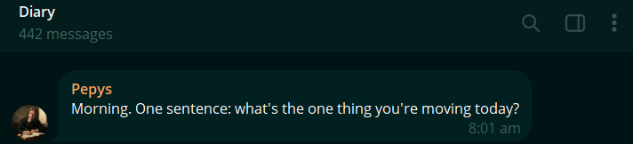
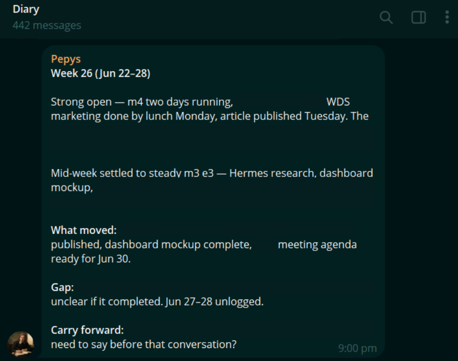
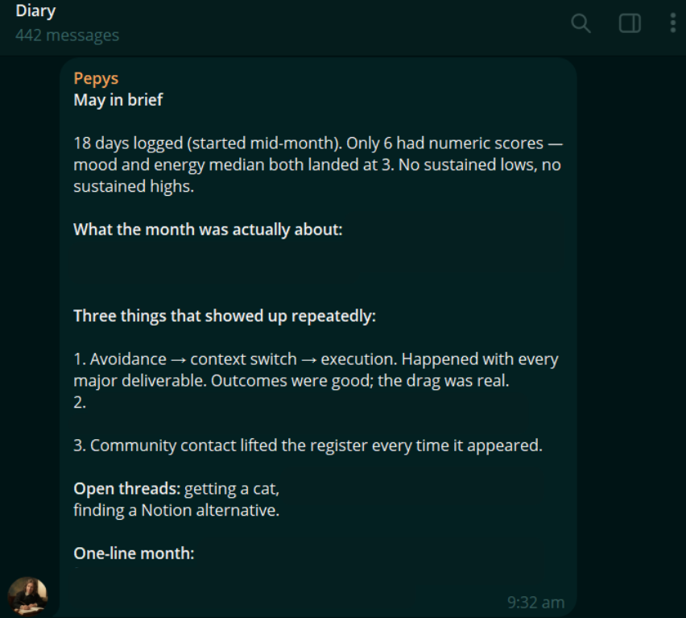

> Dear Diary, how am I doing?

Journaling is a research-backed practice that helps organise our thoughts, process emotions, build self-awareness, and aligning daily actions to our core values. 

But the book-and-pen version of journaling has *never* stuck for me. While I like the idea of organising my thoughts, becoming more self-aware, and checking whether my daily actions align with my values, I can't commit to taking out a notebook at the end of a long day and writing from a blank page. 🥲

So I built a journaling agent that I can chat with. :) 

## Entries

I wanted to keep track of my thoughts and actions throughout the day. With a busy schedule, it's hard to keep a mental reminder to log entries. 

So I had my agent nudge me twice a day - in the morning @ 8am and in the evening @ 8pm. 

- At 8am, Pepys asks for one sentence: what is the one thing I am moving today?

Amidst all the to-dos for the day, this keeps me focused to have *at least 1 non-negotiable win* for the day.  

- At 8pm, it asks for my mood, my energy and a sentence for the day. 
  
I wanted to document the day, and how I felt about it so I can monitor *how* actions or events shift my mood and energy and with this data, calibrate myself in future.

> Voice notes can also be used to document the day. Groq has a [free tier voice transcription option](https://console.groq.com/docs/speech-to-text).

This solves the first friction I have with journaling: documenting. Next is synthesising daily records into useful summaries to learn from.

## Weekly & Monthly Reflections

At the end of the week, Pepys provides me with a summary of events that happened for the week, how my mood and energy has changed during the week, including:
- what I have accomplished that brought me closer to my goals
- what is the gap to reach my goals, and
- what I need to think about and how I want to show up for the upcoming events
  

> This helps me stay focused on longer-term goals and how I can calibrate my actions the following week.

As weeks accumulate into months, it recognises patterns about me that I could learn from.

Here's an interesting one:

It recognised a recurring theme where I was avoiding things I was supposed to do, but when I context switched (eg. played my ukulele, go for a run, talk to people etc.), then I somehow get rejuvenated and could execute well on the thing I was initially avoiding.

> With this knowledge, I learnt that I work more effectively when I take intentional breaks that shift me into a different mode (ie. physical, social or creative), before returning to the task with renewed energy.

Insights like these are what keep me consistent with journaling through Pepys. By offering a consistent, outside, perspective, it recognises *patterns* in my behaviour that I might not have noticed on my own.

## Personalisation

To make the experience even more personalised, I provided it results of my personality tests so it customises the weekly reviews based on it. 

> Note: Personality tests serve as guides, and are not fixed definitions of who a person is. They capture tendencies at a particular point in time, shaped by context and self-perception. People can change, adapt, and consciously choose how they respond. I use these results as prompts for reflection not as limits of who I choose to become.

| Assessment | What it helps understand | How to use it |
|---|---|---|
| **Enneagram** | A person's underlying motivations, fears, and coping patterns | To examine *why* I react or behave in certain ways |
| **Big Five (OCEAN)** | Broad, measurable tendencies in how a person thinks, feels, and behaves | To understand general behavioural and emotional disposition |
| **PRIOS** | Leadership style, workplace priorities, and interpersonal approach | To reflect on how a person leads, collaborates, and operates at work |
| **Attachment style** | How a person responds to closeness, trust, dependence, and conflict in relationships | To recognise relationship patterns across different contexts |

Together, these assessments offer *different lenses* of a person:
- the Enneagram explores motivation, 
- the Big Five describes traits, 
- PRIOS examines workplace behaviour, and 
- the Attachment theory highlights relationship patterns 

So the weekly and monthly reviews get a **holistic** view of me as a person.

Pepys has made journaling easier for me to sustain, along with identifying my behavioural patterns that allow me to self-calibrate. While a typical journal preserves what I share and my thoughts, Pepys provides additional perspective on my life events, on top of documenting them.
