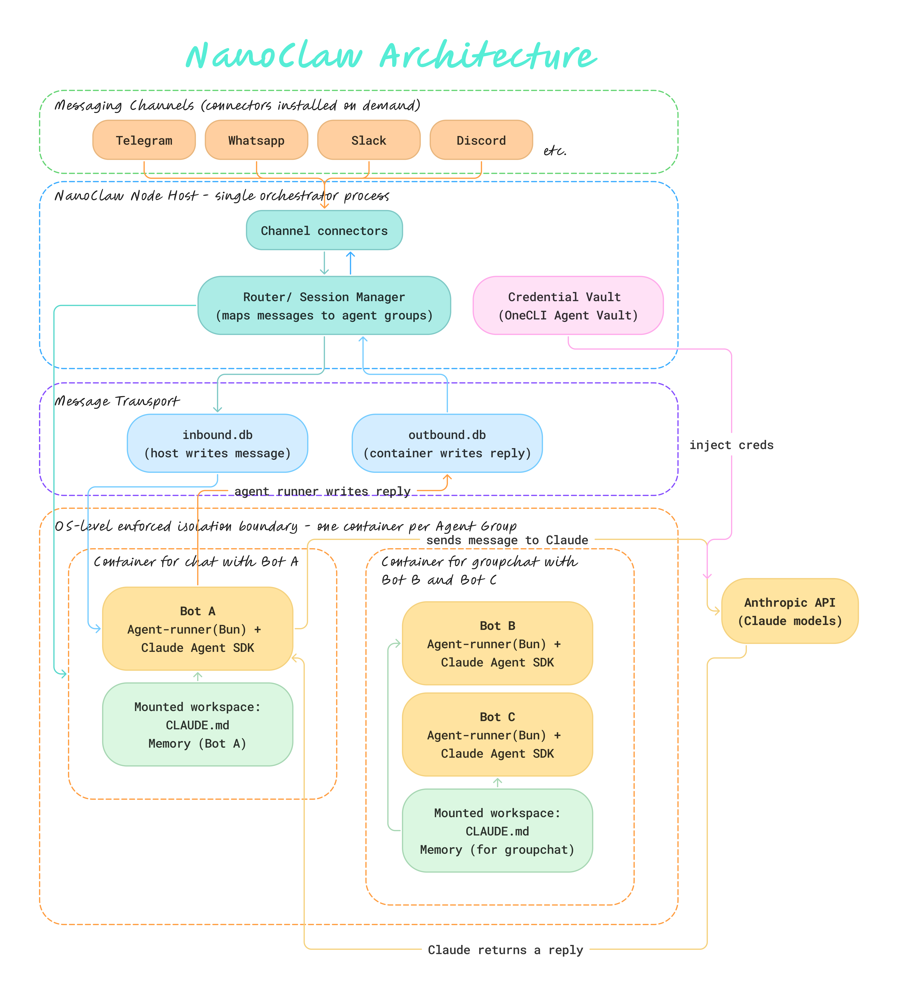

[NanoClaw](https://nanoclaw.dev/) is known for providing a *sandboxed* environment for agents. This secure design limits the blast radius if the agent was compromised. I wanted to find out *how far does this boundary go*, and how is the blast contained in its architecture. 

NanoClaw launched on 31 January 2026, and the v2 was released on 29 April 2026. v2 turned out to be a **ground up rewrite** with key changes that reinforce the security design. 

Before I install v2, I wanted to understand this new architecture so I know how to configure my existing agents. So I worked with Claude to build out a visual of the new architecture and to walk me through each step. 

## What happens while "Typing..."



Bear with me as we go into each step in detail.

First, when I send a message to my agent, it will travel through the Telegram Bot API, then to my PC (ie. the NanoClaw host, wherever you're running NanoClaw on. It could be a VPS, or laptop etc.)

> There are 2 mechanisms that Telegram uses to deliver messages to a bot (NanoClaw supports both):
> 
> 1. Webhook (where Telegram pushes the message) - Telegram makes an HTTP request to your server. It's like knocking on your door and handing over a letter. NanoClaw answers the door and takes the letter. Webhook is used when your NanoClaw server is publicly reachable on the internet with a domain name/public IP address that Telegram can send requests to. This is a typical production setup.
> 
> 2. Long polling (where NanoClaw pulls the message) - NanoClaw asks Telegram if there's any messages every few seconds. Telegram leaves the connection open until something arrives, then replies with the message. Longpolling is used when your server is not publicly reachable ie. when you're running NanoClaw locally on your laptop.

So the message arrives at my PC in a blob of data that looks like this:

``` json
{
  "message": {
    "chat": { "id": 123456, "title": "Agent Team" },
    "from": { "id": 789, "first_name": "Zawanah" },
    "text": "Hey bot, what's the schedule like this week?"
  }
}
```
Now this message is being held by NanoClaw's channel connector as a variable in memory. 

The channel connector then calls the Router directly to pass the message as an argument:

```javascript
// Inside the Telegram Channel Connector
const incomingMessage = normalise(rawTelegramPayload)
// After normalising, the incomingMessage now looks like:
// { chatId: 123456, chatTitle: "Agent Team", fromId: 789, fromName: "Zawanah", text: "Hey bot, what's the schedule like this week?" }

router.handle(incomingMessage)
```
The normalise step is important for the Channel connector to *translate* the raw Telegram-specific payload into NanoClaw's own common format. **Regardless of where the message came from which channel, by the time the Router sees it, it will look the same.**

The Router then checks its lookup table for `chat_id: 123456`. If "Agent Team" has messaged before, there will be an existing container. If it's the first message from "Agent Team", the Router will spawn a fresh container, mount a new workspace, and register `123456` for "Agent Team" conversations for next time. 

Once the container is found, the Router writes a row into the container's `inbound.db`:

| id | chat_id | from_name | text | status |
| :---: | :---: | :--- | :---: | :---: |
| 1 | 123456 | Zawanah | "Hey bot, what's the schedule like this week?" | pending |

Inside the container, the agent-runner (Bun) is polling `inbound.db`. When it sees the new row, it pulls it out, and loads context from the mounted workspace ie. the CLAUDE.md file and any saved memory for the "Agent Team" groupchat.

```javascript
// agent-runner.js — executed by Bun
while (true) {
  const newMessages = inboundDb.query("SELECT * WHERE status = 'pending'")

  for (const msg of newMessages) {
    const context = loadWorkspace("/workspace/CLAUDE.md", "/workspace/memory")
    const reply = await claudeSDK.send(msg.text, context)
    outboundDb.insert({ chat_id: msg.chat_id, reply_text: reply })
    inboundDb.markDone(msg.id)
  }

  await sleep(500) // check again shortly
}
```
The agent-runner then hands the message and context to Claude Agent SDK, which formats a request and sends it to Claude:

```javascript
{
  systemPrompt: "...CLAUDE.md content for Agent Team...",
  messages: [
    { role: "user", content: "Hey bot, what's the schedule like this week?" }
  ]
}
```
Outbound API calls to Claude are routed *through* the OneCLI's Agent Vault as a proxy that sits between the container and the internet. When the Claude Agent SDK wants to call Claude, it makes the request outward, and **the vault intercepts that outbound call and stamps the real credential onto it at the proxy boundary**.

> The OneCLI Agent Vault is a gateway that handles credential injection, access policies, and approvals so the agents or container *never* actually hold or contain the raw API keys. 

Then Claude would generate a reply like "This week, the Agent Team has a discussion at 10am Monday" which gets written into the container's `outbound.db` by the agent-runner :

|id | chat_id | reply_text  | status |
| :---: | :---: | :--- | :---: |
|1  | 123456  | "This week the Agent Team has a standup Monday..." | pending|

My PC would be watching `outbound.db`. It sees the new row, then read `chat_id:123456`, and look up the "Agent Team" telegram groupchat. Then it will hand over this reply to the Telegram Channel Connector.

The Telegram Channel Connector then calls the Telegram Bot API to send the message back into chat 123456. The message would then appear on my telegram groupchat.

## If the Agent is Compromised

Mapping it out helps to clearly see how the structure works to prevent any leak when the agent is compromised. 

**1. Communication between the Agent and the Host (my PC where my digital life lives) is a dead drop**

My PC doesn't pass messages to the Agent (and vice versa) through an open connection, but rather, into database files - `inbound.db` and `outbound.db`. So there's *no live channel* for the compromised Agent to crawl back up to my PC.

**2. Strictly isolated agent containers**

The Agent *only lives it its own container*, with its own workspace ie. own CLAUDE.md file and memory. There's no way for it to learn another Agent's context or memory because they're physically not mounted into the same workspace.

**3. Agent never sees my API keys or secrets**

OneCLI injects the API keys outside of the container only at the instant of the request so even if Agent is compromised, I can be assured that *there are none of my credentials that it could steal*. 

## Specialised Agents

With strict boundaries, this makes the architecture *ideal* to build specialised agents. 

While I may not be comfortable (yet) to have an all-in-one assistant that has root access to my PC, I have some important use cases to build specialised agents for:

1. Personal Scheduler - there's simply too many clicks to set up a Gogole calendar event, compared to typing in a single sentence to my agent
2. Diarist for Journaling - writing my thoughts in a book is not as easy as typing in a chat on the go
3. Executive Coach - for big career-related decisions that require greater consideration and alternative points of view before committing
4. Home Manager - keeps us on schedule for home management eg. aircon servicing, home improvements and DIYs, managing grocery inventories and more.

I share details of each agent in their respective pages, including what I built it for, what tools I grant them access to, and how it has been working for me thus far. 

