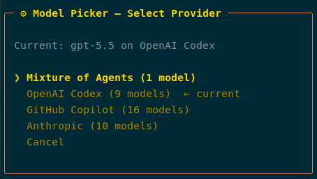
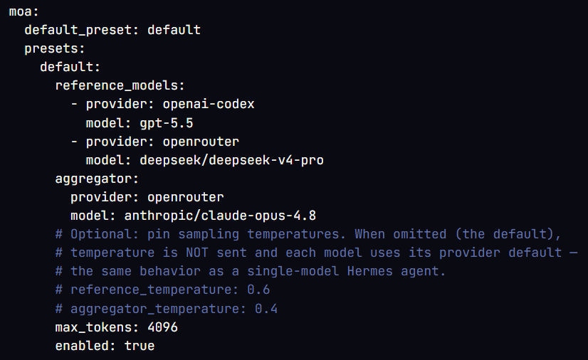
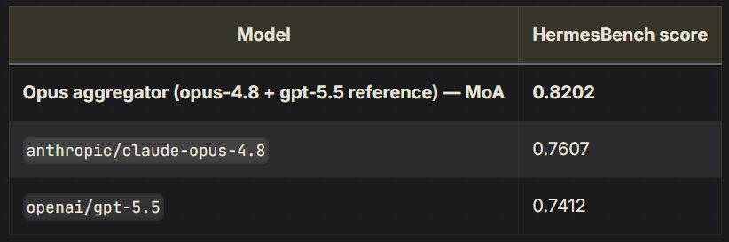

I used up my weekly usage limit on the ChatGPT Plus plan in 2 days, and wanted to cry. 

But instead, I did something productive, which was to explore options. I could either upgrade my existing plan or switch to another model provider.

Typing `/model` , I saw an interesting option: Mixture of Agents (MoA).

## What is MoA

The MoA is a virtual model that combines multiple LLMs to derive a response.

As its name suggests, instead of sending your task to a single model, it runs **2 or 3 LLMs in parallel**, and has an **aggregator model** combine them into a final answer. 

> So the response from MoA is backed by several models cross-checking one another. 

We can be [explicit with the provider and model pairings in this setup](https://hermes-agent.nousresearch.com/docs/user-guide/features/mixture-of-agents) and it can be easily configured in the `config.yaml` file.

The reference models (aka advisors) are the ones that will work on the task in parallel, while the aggregator model gets their outputs and then derives the final response.

## How it works

The advisors don't get the full picture. They run first, in parallel, and each of them only sees the plain conversation text and they're not allowed to call tools. 

Their respective output then gets appended as private context to the aggregator model's prompt.

Only the aggregator model sees the Hermes system prompt and has tools available for use. The aggregator's response because the reply that we see. 

## Why use MoA

So the task goes through multiple models before we get a response and we're basically signing up for a token burner pro max plan. 

It might be worth it if the output is *significantly* better than the individual models.

The current MoA preset (Opus 4.8 aggregator and gpt 5.5 as reference model) and scores better than the individual model by ~6 points. 

So this does prove that having an aggregator model improve the results of the response. However, whether this applies to every task would depend on the nature and use cases.

## Is MoA worth it

For routine prompts, a single model is faster and cheaper for basically the same output.

For tasks where we'd want a second opinion eg. decisions with no obvious right answer, it may be worth using MoA. 

