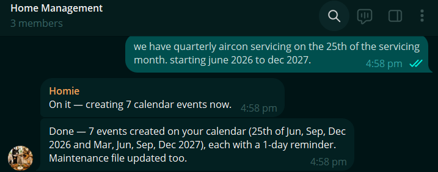
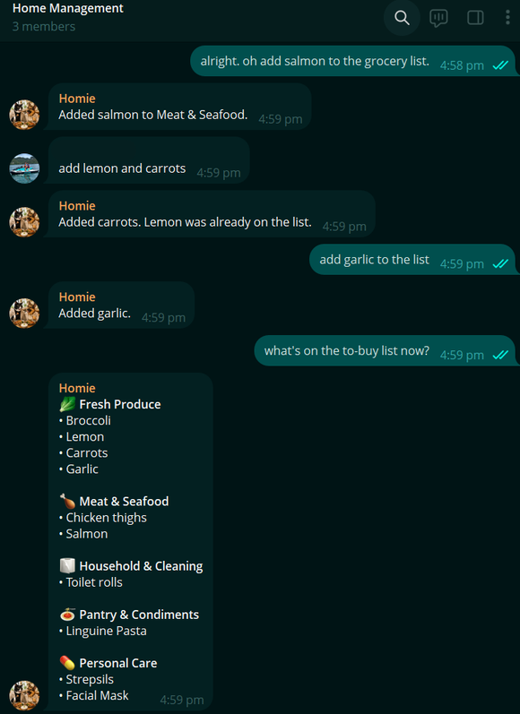
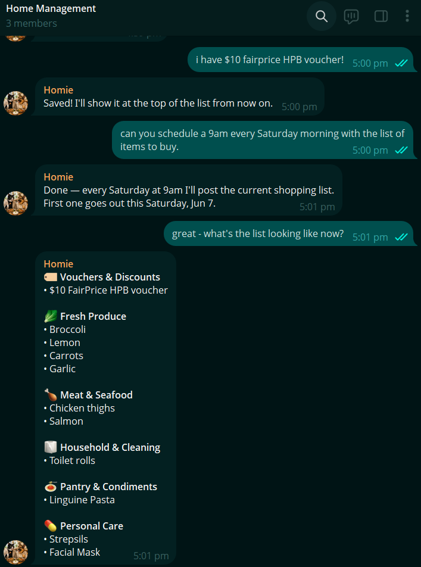

Managing a home requires communication and coordination among members of the household. At least one person must be home during aircon servicing, someone has to collate all grocery needs, setting reminders for upcoming aircon servicing in the next quarter or cleaning services and more.

Individual tasks can compound, adding to the mental load, on top of our busy schedules. 

So I figured having an agent that coordinates these tasks like a Chief Operating Officer could ease this burden, starting with maintenance schedules.

## Home Maintenance Schedules

Once aircon servicing dates are settled, I share the schedule with the agent, and it updates my calendar, and set reminders to the group.

The same can be done for cleaning schedules and more. 

## Shared Assistant for every Household Member

The Home Manager is designed for the entire household group, not just for me. 

When I register the telegram bot as an owner, I can give permission for it to speak to *all or specific members* of the group. 

Household members that are given access can talk to it, add more to the grocery lists or ask about upcoming home appointments. 

## Grocery Lists & Inventory

If not ordering groceries online, this works well to maintain a running grocery list. 

*Anytime, anywhere,* if I remember something that I need to buy, I chat with Homie to add it in.

Similarly, it can track vouchers like HPB or CDC vouchers!

Before the usual grocery run, eg. 9am every Saturday, Homie sends us the grocery list *accummulated* to date. 

> Having a tracked list be the source of truth for everyone in the household reduces the chance of forgetting items to be purchased.

Without Home Manager, the appointments live across calendars, we get the grocery lists up at the last minute, and household updates happen through informal conversations. While each method works, together they feel *fragmented* and easy to lose track of.

Homie gives us **one shared place** to capture these details as they arise and recalls them when we need it. It makes the work of running our home more visible, coordinated, and less dependent on any one person remembering everything. :) 

