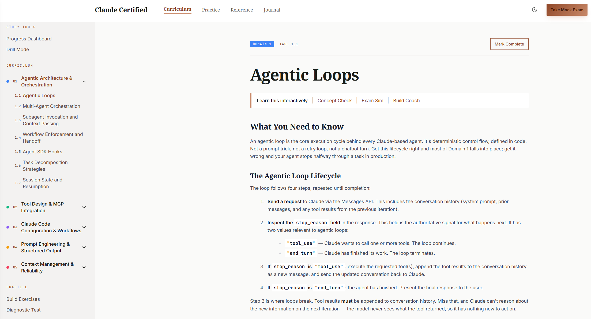
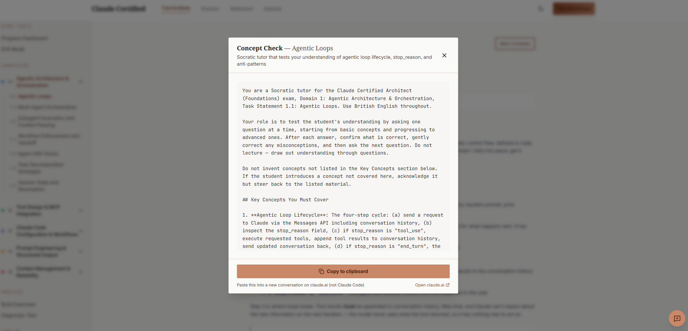
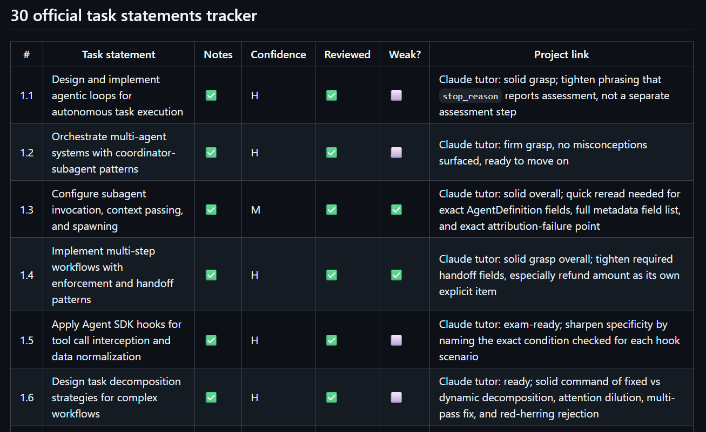
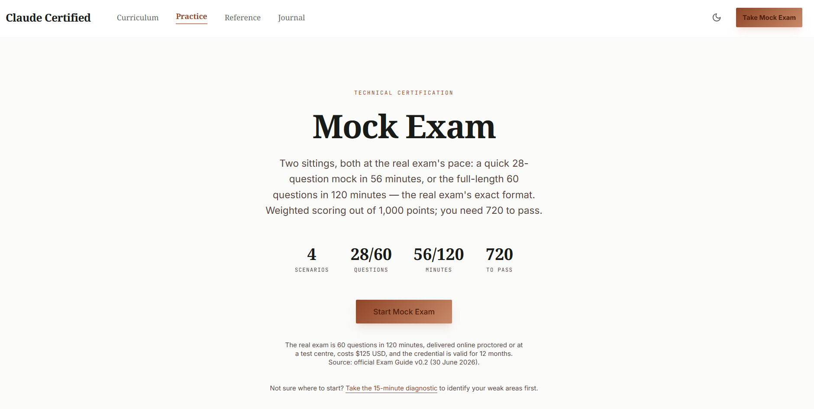
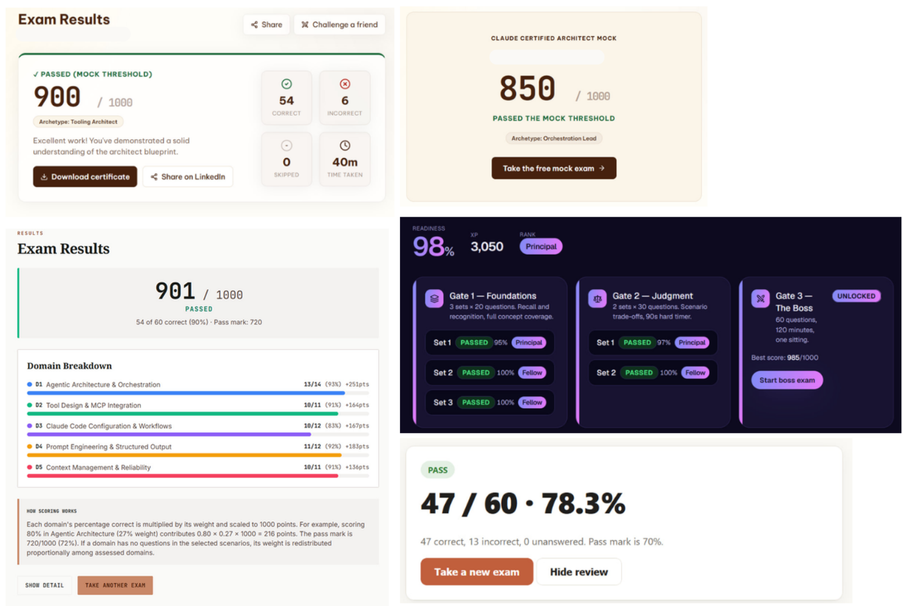
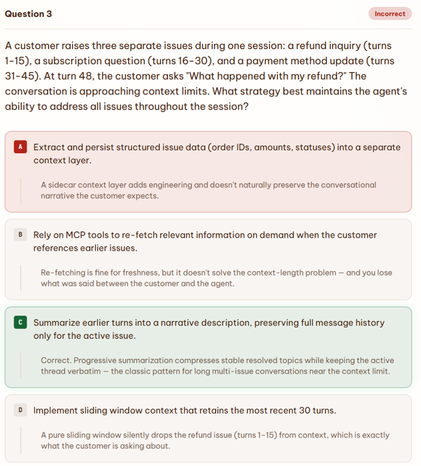
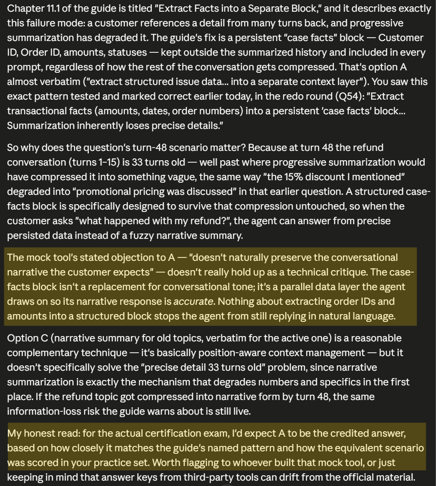
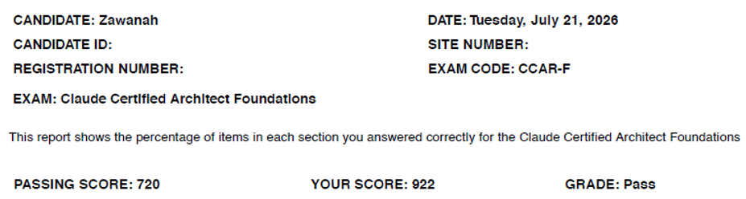

Over the past few months, I have been building agents with [NanoClaw](https://zawanah.com/series/nanoclaw/) and, more recently, [Hermes](https://zawanah.com/series/hermes/). I was driven by my own use-cases and curiosity for how these open-source agent harnesses work.

Although I had been directing my own experiments, I wanted a more structured understanding of the architectural decisions behind agentic systems, and I wanted to use Claude Code more deliberately in my day-to-day work, rather than discovering its features as and when I need or read about them.

So I thought studying for this exam would be a useful way to do both.

## Study System

My main study material was the [Claude Certification Guide](https://claudecertificationguide.com/learn) by Walter. I enjoyed learning on this platform because it distilled **all** the key concepts across all 5 exam  domains, in a *very concise* manner.  

Within each domain, there are all the task statements of the CCAR-F exam and for each task statement, the content immediately highlights the key concept(s) that are tested. 

On top of that, there are also explanations for common distractors and anti-patterns (ie. ultimate no-nos).

> For example, in an agentic loop lifecycle, the **only** way the loop stops is when the `stop_reason` field is `end_turn`. Not by parsing natural language signals, not by arbitrary iteration caps and not by checking if the assisant_message has a text response - the 3 anti-patterns.

At this point, for each task statement, my curiosity is satisfied. 

But wait, there's more... :3 

Once I've grasped the concept and underlying principles for the task statement, I get to *immediately* test them, using the `Concept Check` and `Exam Sim` option. 

This is where I used Claude as a tutor. After testing my knowledge with `Concept Check` and `Exam Sim` , I talked through the concepts with Claude to clarify any misconceptions and to eventually master them. **This accelerated my learning.**

So I went through these steps and paced myself for each task statement in each of the 5 domains. I tracked them with my Hermes agent, Zermès, and made it **highlight my weak areas so I can optimise my learning from here on**.

For a deep dive into specific concepts and areas, I referred to the [Claude Certified Architect Guide on GitHub](https://github.com/paullarionov/claude-certified-architect). This guide is more detailed and more of a textbook-style.

After I had worked through all task statements in all 5 domains, done diagnostic tests, and worked on my weak areas, I do the mock exams. 

Since March 2026, there are many variations of mock exams built by fellow CCAR-F learners and so I completed the mock exams I could find to bridge any gaps on key concepts or principles through real scenarios in the mock exam. 

Here are the mock exams I used to practice:
1. [Claude Certification Guide Mock Exam](https://claudecertificationguide.com/mock-exam)
2. [CCA Mock Exam by CyberSkill](https://ccaf.cyberskill.world/)
3. [The Gauntlet](https://cca-f.codeandcraft.ai/)

I paced myself by doing a mock exam daily up to my exam date to ensure that the concepts stay fresh in my mind. 

I researched to understand how my performance on mock exams would generalise for the actual exam, but the only information I could work with was [this Reddit post](https://www.reddit.com/r/ClaudeAI/comments/1u43exm/passed_the_claude_certified_architect_foundations/) which said that the most challenging was the mock exam by CyberSkill so when I passed with >80% on this mock, I could safely consider myself exam-ready.

While mock exams have been very helpful, it's wise to **remain critical** when reviewing the results, and *not treat it as the holy grail*. The objective is to test reasoning, not simply memorising whichever option the mock exam marked as correct.

For example, here's a question about maintaining key facts after several turns in a conversation. I picked Option A, but the mock exam's answer is Option C.

Both options could work. However, the question asks which strategy **best** maintains the agent's ability to address **all** issues. 

Summarising earlier turns (Option C) *may lose some information in the process* (eg. Customer ID, refund amount). 

Conversely, **a persistent case facts block serves the exact purpose of storing important facts** (Option A) and is *kept outside of the summarised history (so no information will be lost on subsequent summarisations)*. 

> Because of this, Option A is the more accurate answer.

I asked Claude to assess both options against the reasoning supplied by the mock exam. Its conclusion was that the criticism of a persistent case-facts block did not hold up technically. The block is not meant to replace conversational context, rather, it preserves precise information alongside it.

If you're thinking it, yes, the options given are tricky! Out of 4 options provided, you can probably eliminate 2 options easily but the other 2 will be really close. Stay alert!

> Memorising doesn't work

While we are certain that there are 6 scenarios that the exam can test on, and some questions may appear again and again on the mock exams, there are *many other variations of questions around real scenarios* that require applying key concepts and principles of how to best use Claude. 

## Exam Experience

I took the exam at a test center and the admission process was smooth and quick. 

In the exam room, the environment wasn't as conducive as I thought it would be. There were others who were taking other exams that require a lot of typing (on very clicky keyboards). They did provide me with earplugs though I think my home environment would have been a better choice. Perhaps other test centers might provide a more conducive environment.

Once I submitted my answers for the exam, I *immediately* got my score report on screen and it showed that I had passed. 

> If the exam was taken online, it will take several days before the results will be released as they have to review the proctored exam before sharing the results.

There is a summary of percentage of questions I got right against the various test objectives. However, I wish they had matched the exact questions so I can actually see the questions I got wrong or right (and learn from it). 

My score report was then printed and stamped for me, and I was free to leave after. The score report will also be sent via email. 

A few hours later, Anthropic sent an email inviting me to claim the [CCAR-F badge](https://www.credly.com/badges/0a3057b8-2c86-4dc7-a78b-b0007b95c0d4/public_url). :)   

  

  

It was a rewarding journey, and I finished it feeling even more motivated than when I started. Perhaps I’ll carry that momentum into CCAO-F next. ;)

