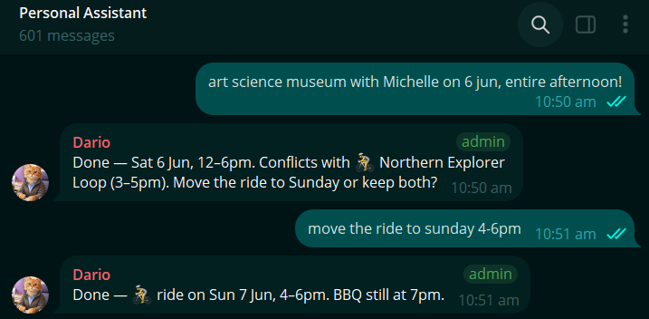
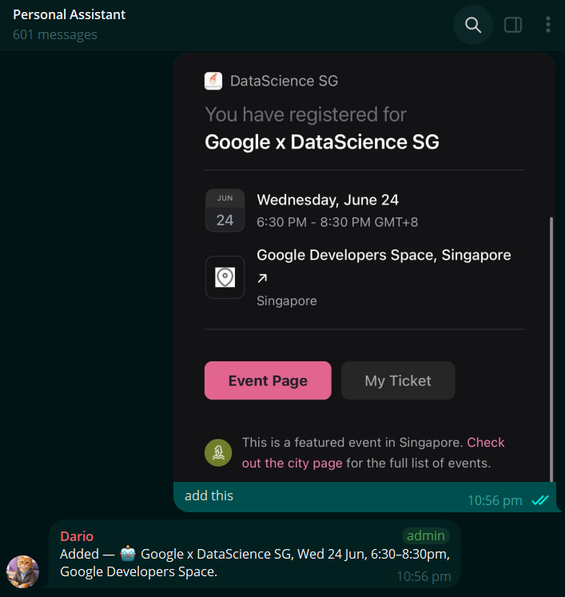
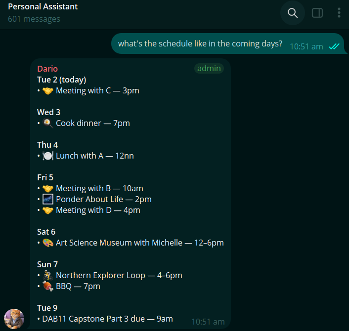

The first agent that I built is **a personal scheduler**, and it came from an urgent need.

I enjoy scheduling events and populating my calendar because.. I like the illusion of control over my time. 🙂‍↕️

However, each time I needed to add something to my Google calendar, I have to click and populate many fields at *specific* and *different* parts of my phone screen and this is such a high administrative burden. 

That is the friction in my current "add to calendar" workflow so, I strive to remove it.

## Setup Events & Flags Conflicts

Now, my personal scheduler turns my message into a scheduled event on my calendar *automatically*. 

I no longer have to click into fields or apps and update the different types of fields. It **interprets my request, checks for conflicts (and alert me if any), creates the event, then reports back to me.**

Here's an example where I schedule: 

> Art Science Museum session with Michelle on 6 June, for the entire afternoon.

It *flags* the conflict with `Cycling at the Northern Explorer Loop` and *suggests* if I want to postpone the Sunday ride. 

When I decided to move the Sunday ride, it did as instructed.

For events I signed up to attend, I can send a screenshot of the event details, and it can **read and analyse the images, and extract event details** to schedule the event. It also works with `pdf`, `csv`, `jpg` and `png`.

For example, I registered for an event on Luma, and sent a screenshot with the event details over:

This also works for a `pdf` list of events, dates, and times.

## Summary of Events in the coming week

It was helpful to summarise events coming up in the week so I can get ahead and prepare for it.

That was really all that I needed my personal scheduler to do: removing that simple frustration of clicking into an absurd number of fields to add an event. Summarising events for the coming week was a bonus that helped with focus for the week.

