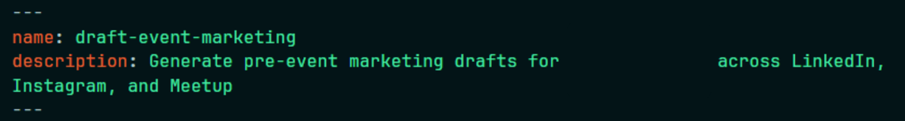

I signed up to write pre-event marketing copy for an organisation for the first time.

Every planned event needs pre-event marketing copy to publicise it. The copy has to contains key details of the event, should reflect the brand voice, and fit the different *formats* and *character limits* across platforms.

As a first-timer,
1. The brand voice was *not instinctive* to me, so I could only use past events' copy as references. There was also no brand voice guide that I could use.
2. I am racing against time as the copy needs to be out as soon as the content is ready.

## The First Attempt: Prompting in Chat

I gathered past events' copy to use as reference for the brand voice. This took about 5 minutes. With that, I worked with Claude to generate a first draft.

The first draft wasn't perfect (as expected). Specifically, there were too many emojis used, assumptions made about the content of the upcoming event (eg. hands-on work emphasis when actually, the speakers were the ones doing the demonstration), and the copy exceeded the character limit across the various platforms.

So I did a couple of iterations until I was satisfied with the output. That took about 15 minutes. Reviewing the copy after each iteration was a time sink due to the non-deterministic nature of LLMs.

Once I was satisfied with the main content, I did some manual edits on phrasing and technical accuracy, taking up about 5 minutes.

Overall, the entire process took about **25 minutes**. For work that occurs once in a month, perhaps this is fine but the process could be more *efficient* and made a lot *easier* on human review by designing a Claude skill for it.

## Designing a Claude Skill

The goal is to design a skill that I can easily invoke for *any future events*.

The brand voice, and platform restrictions are constraints that need to apply to all pre-event marketing copy created with this skill. Only event-specific content (and speakers) will change.

So I worked with Claude to produce the SKILL.md file to include those constraints.

For a skill to be successfully invoked:

1. The **YAML front matter block's description** must give *enough context* for Claude to know when to load the skill.
   
2. The **folder structure** where the SKILL.md file sits, must be consistent so Claude recognises it as a skill. 

    `.claude/skills/draft-event-marketing/SKILL.md`

Since creating this skill, I have used it for 3 subsequent events and what initially took me ~25 minutes, now takes me just ~5 minutes to review :) 

> Could I optimise further?

Probably not.

While the skill has significantly reduced the time it takes to generate a pre-event marketing copy, the 5-minute review is *important* to ensure that the model **had not hallucinated or invented any event or speaker details**, and that the model **had not drifted from the brand voice**.

## CLAUDE.md vs Skills vs Commands

I considered simply adding these instructions into the CLAUDE.md file, but decided it would not work because I could be working on post-event marketing copy (instead of pre-event marketing), which has slightly different requirements, or I could also be writing other types of copies for the organisation.

> **CLAUDE.md** files are loaded into context at the start of the conversation so it would take up space in the context window, even if I am working on other tasks other than pre-event marketing. 
>
> **Skills** are a better fit for **task-specific workflows**. Only the YAML front matter are loaded into context for Claude to decide which ones are relevant to be loaded for the task it is given. 
>
> **Commands** function similarly to Skills, only that commands need to be explicitly invoked. While Skills can be explicitly invoked, it can also be automatically loaded by Claude.

There are 4 other methods to deliver instructions to the model, explained in detail [here](https://claude.com/blog/steering-claude-code-skills-hooks-rules-subagents-and-more).

Generating a pre-event marketing draft was task-specific, reusable, and can be described easily for Claude to recognise the request, so **a skill is the best fit**. 

The `/draft-event-marketing` skill now handles the recurring constraints that previously consumed most of my time, while I spend the 5 minutes to verify the facts, and ensure the brand voice remains. 

## Reviewer stays Human

AI is often discussed in terms of whether it will replace humans. I believe the reality is about asking ourselves which parts of the work should be automated, and which still require human judgement.

The skill can apply recurring constraints, follow platform requirements, and produce a strong first draft. But it *cannot* be accountable for publishing an inaccurate event detail, misrepresenting a speaker, or allowing the brand voice to drift. That responsibility remains with me, the human reviewer.

For me, this is what thoughtful AI integration is: using AI to remove repetition, not responsibility. The workflow is now faster and more consistent, but the final decision remains human. :) 

