I’ve built my personal AI agents on top of NanoClaw, and I’m sharing the setup here.

NanoClaw is an AI-native software, so there’s no setup wizard or guide. NanoClaw v1 was launched on GitHub on 31 January 2026, and v2 was a ground up re-write, released on 29 April 2026.

Good news is that v2 setup is slightly more straightforward than v1’s fork and clone repo, /setup dance.

## Step-by-Step Guide - Standard & Recommended Setup

**1. Fork and clone [NanoClaw's repo](https://github.com/nanocoai/nanoclaw.git) to your local machine**

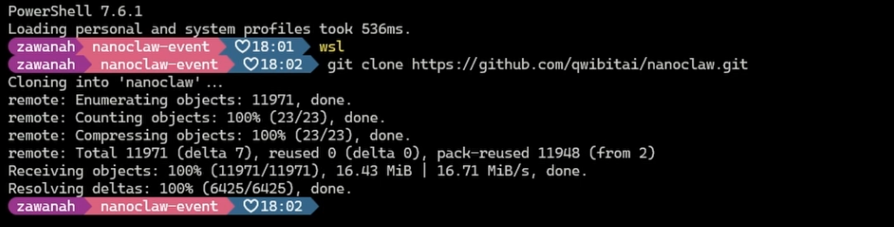

> Note that since I have built the setup, the github account name has changed so clone with this link instead: https://github.com/nanocoai/nanoclaw.git

**2. Change directory into the `nanoclaw` folder and run the installer `bash nanoclaw.sh`**

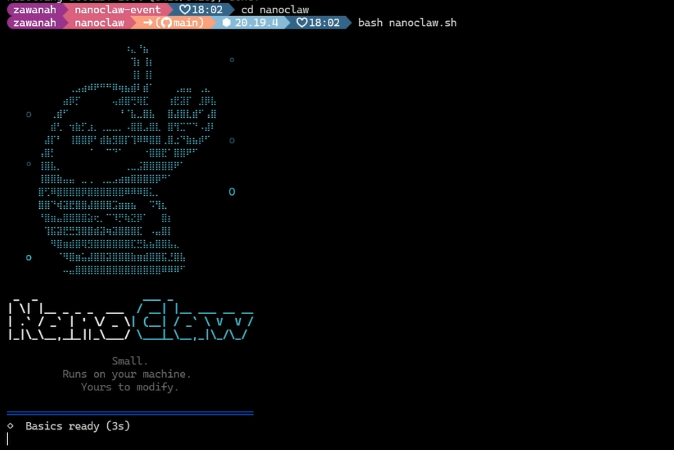

This starts the installation.

**3. Opt for standard setup**
   
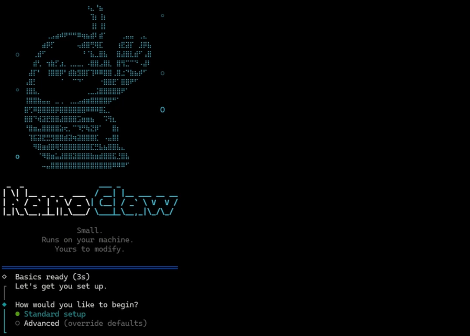

**4. Check and install dependencies**

Once run, the installer checks whether the system is compatible and whether the core prerequisites are available. These include Node.js, pnpm, and Docker.

Claude Code is also used for setup recovery, customisation and installing additional channel integrations. If any core prerequisites are missing, the installer will guide you through installing them. 

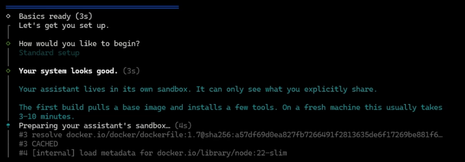

**5. Setup OneCLI account**

Configure OneCLI for credential handling. 

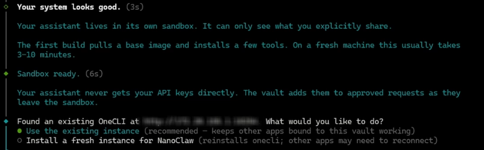

> OneCLI is a vault that keeps all your API keys and token(s) securely, outside of the agent's container.

**6. Connect Claude account and set access rules**

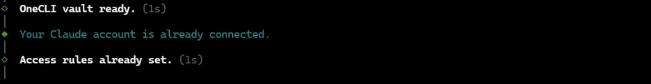

NanoClaw natively uses Claude Code via Anthropic’s official Claude Agent SDK, so you would also get the latest Claude models. 

There are other drop-in options as well eg. /add-codex for Open AI’s codex, /add-opencode for OpenRouter, Google, Deepseek etc. You may configure this per agent group.

**7. Decide what the Agent should call you**

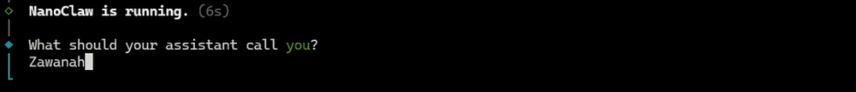

**8. Continue with setup after it tests that the agent is responding correctly**

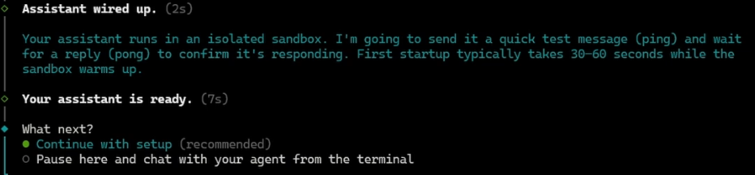

**9. Set timezone**

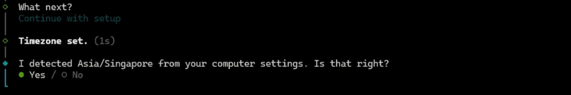

**10. Select the channel(s) where you plan to communicate with the Agent**

I recommend picking the channel that you are most on for easy access. I am on Telegram more than Whatsapp so this guide will show next steps for Telegram. However, other channels' setup should be pretty straightforward from here on.

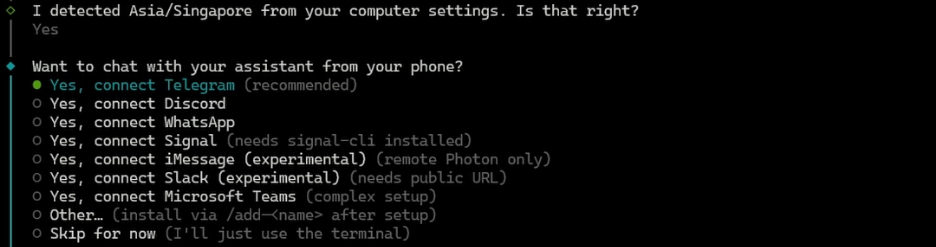

**11. Setup Telegram bot with @BotFather**

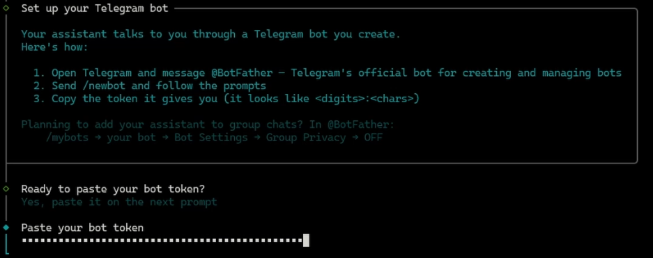

Follow the steps to create a Telegram bot with @BotFather, then copy the token for the bot, and paste it in.

**12. Pair your Telegram bot**

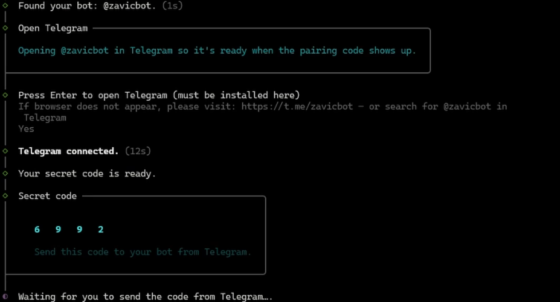

With the token, it will find your bot, and then prompt you to open Telegram to pair.

**13. Register as owner**

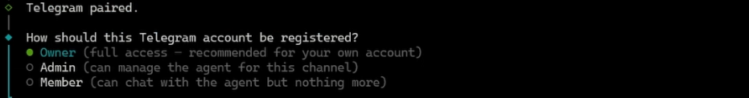

Once paired, register the account as Owner for full access since it's your personal agent.

**14. Decide your agent's name**

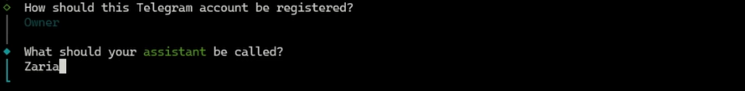

**15. Welcome message from your newly created agent**

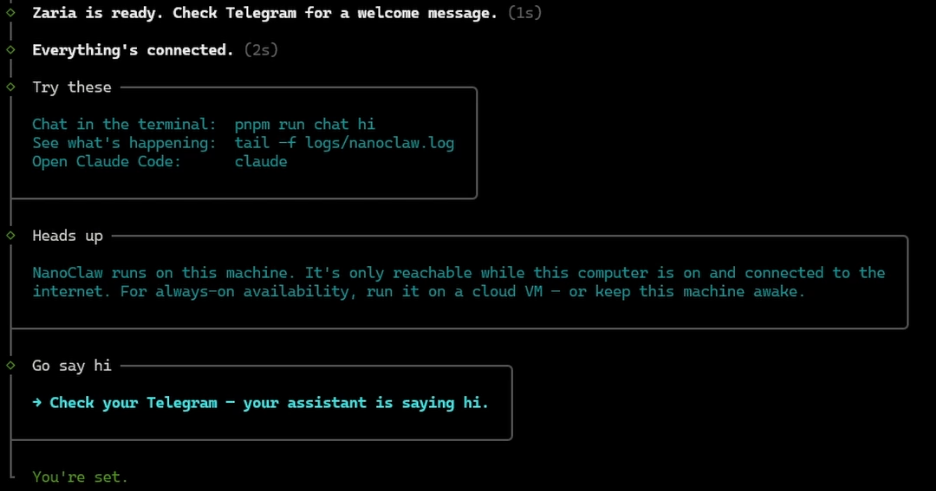

Once everything is connected, you'll receive a welcome message from your agent! 

This is just the beginning. You can now add specific personalities, and roles for the agent. Customise it for your own use case and lifestyle. 

If you're looking for inspiration, I share about some of my agent builds in the NanoClaw series. 
