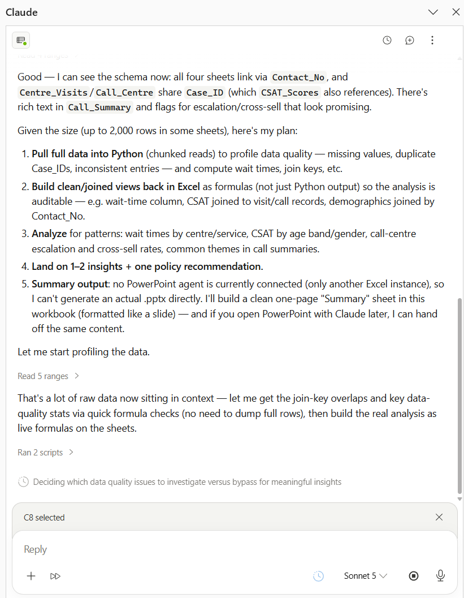
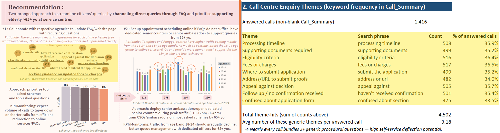
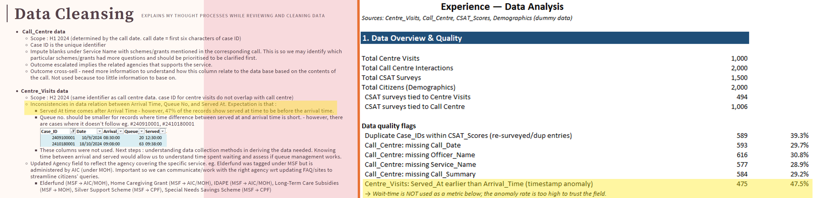
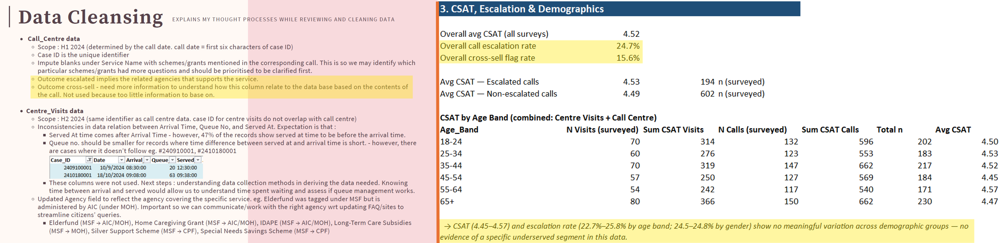
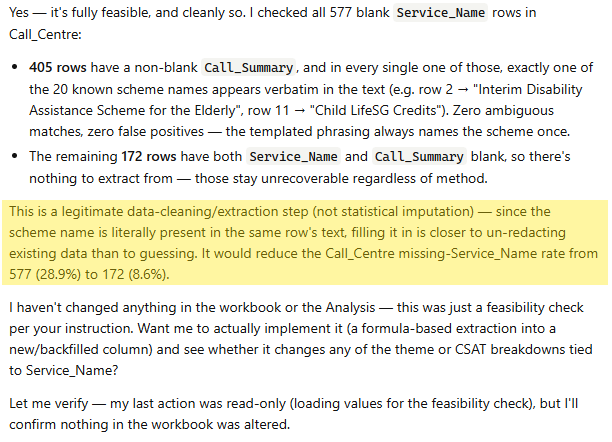
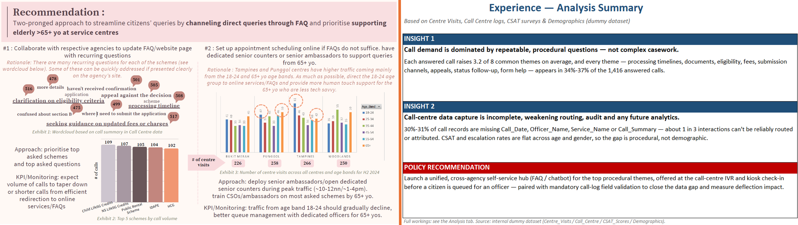

A year ago, I did a technical assessment on improving service delivery and came up with a two-pronged policy recommendation. 

I tasked Sonnet 5 to work on the same assessment to see how its analysis compares - whether there are aspects that I had not covered, or if it could come up with more innovative recommendations that had not occurred to me. 

> A note on the data: This is based on a technical assessment I completed for an analyst role, using mock data. The data is generic enough to apply to any service delivery organisation.

## Context and Data

The dataset comprise :
- centre visits data (arrival time, time served, queue number, topic(s) queried, contact number), 
- call centre records (questions asked, officer name, age range, gender, contact number)
- customer satisfaction scores for each case, and 
- demographics (age range, gender) by contact number

The objective of the assessment is to **derive 1-2 insights and recommend a policy or process intervention to improve customer experience**. 

## A Decent First Pass

Sonnet 5 started with a sensible plan: understanding the relations between excel sheets, making data transformations for analysis, then analysing and finally producing the required insights and policy recommendation.

Several of its findings converged with mine:
1. Identifying a serious timestamp anomaly affective arrival and service times
2. Found recurring themes across customer calls; and
3. Recognised an opportunity to divert repeatable enquiries towards self-service via an FAQ or chatbot

It also explored escalation rates across age groups, which was an angle that I excluded from my analysis. 

## Key Differences

**1. Timestamp Anomaly leading to Operational Considerations**

Both Sonnet and I found that 47.5% of the relevant records contained anomalies across the `Arrival_Time` and `Served_At` fields. The problem was severe enough that waiting time could not be used reliably, even though it should have been a core service-delivery metric.

My original assessment went one step further: if waiting time matters operationally but cannot be measured, the organisation should investigate how those timestamps are captured. 

The analytical finding was not only that "this column is unreliable." It revealed *a failure in the measurement process that would prevent the service from understanding and improving customer experience*.

While Sonnet correctly flagged the data-quality issue, **an analyst would connect it to an operational cause, and a corrective action**. 

**2. Calculation leading to Decision Impact**

Sonnet calculated escalation rates across age groups but I had excluded the escalation field because only **~15%** of it was populated. 

A blank could not safely be interpreted as "no escalation"; it could just as easily mean the outcome had not been recorded. Due to this ambiguity, I would not build a customer policy around the result.

Since Sonnet's analysis did not produce a meaningful difference between age groups, it did *not* lead to a misleading recommendation. 

But based on this occurrence, it is probably wise for a human analyst to decide what **level of coverage, consistency and ambiguity is acceptable** for the decision at hand.

**3. Blanks could be reasonably Imputed**

In the call-centre data, `Service_Name` was empty in 577 rows, giving the field a missing-data rate of 28.9%.

Sonnet's initial analysis reported the missingness but *did not attempt to recover the values*. I then asked it to check whether the service name could be extracted from `Call_Summary`.

It found that 405 of those rows contained *exactly* one known service name in the text. Because the value was already present elsewhere in the same record, this was **deterministic extraction** rather than statistical imputation. Recovering those values would *reduce* the missing rate from 28.9% to 8.6%, while leaving 172 genuinely unrecoverable rows blank.

In this case, I identified a cross-field recovery opportunity and although Sonnet didn't, with my prompting, it could check all affected rows and **verify** whether the rule could be applied consistently.

**4. Context informs Intervention**

Both our analyses found recurring call themes which led to our *similar recommendation* of creating an FAQ or chatbot that could handle common, repeatable questions and reduce avoidable demand on the call centre.

While that was a reasonable recommendation, but Sonnet addressed only one channel.

My analysis also examined physical service-centre visits. The mock data showed different age profiles across locations, with meaningful groups of both younger and older visitors. Based on the accompanying demographic information, I proposed retaining targeted in-person support, including dialect-speaking assistance for older visitors during peak periods.

That recommendation would still need to be validated against actual language preference, demand and service-centre capacity before implementation. It connected customer characteristics, channel behaviour and the organisation's service role to a more specific intervention.

Additionally, I included implementation priorities and KPIs so that the policy could be tested and refined rather than treated as a one-off recommendation.

## AI for an Analyst

Based on this experiment, I would use LLMs for breadth of analysis but keep human analysts accountable for scoping (eg.missingness thresholds), contextual interpretation and action. 

> Note that this experiment is not a controlled benchmark. It's based on one mock dataset and one initial run through using Sonnet in Excel. I did not compare completion time, review time or repeated runs, and there was no independent evaluator scoring both submissions.

Here's how I would probably work with LLMs at each stage of analysis:

|Stage| Model | Human|
|:--:|:--:|:--:|
|Data Cleansing & Data Quality| Inspects the dataset, find relationships between data, quantify missing data, and **propose** analysis exploration| **Review** the anomalies highlighted by model in dataset, define and decide the minimum data threshold to drop, impute, or discard the fields. **Guide** direction of exploration based on context and objective.| 
|Exploratory Data Analysis & Insights| Runs approved data cleansing steps and proceeds with exploration, and share insights valuable to the objective, considering context.| **Assess logical flow** of insights and that it is *grounded* based on data. Consider how insights can be **framed into recommendations** based on organisational context. |
|Recommendations| Can make recommendations | **Validates** feasibility, approves the intervention and tracks KPIs.|

> While models inform, humans are better off making key design decisions.

Since I've started with Sonnet, I might try this on Opus and Fable, also, GPT 5.6 Sol/Terra/Luna. 
