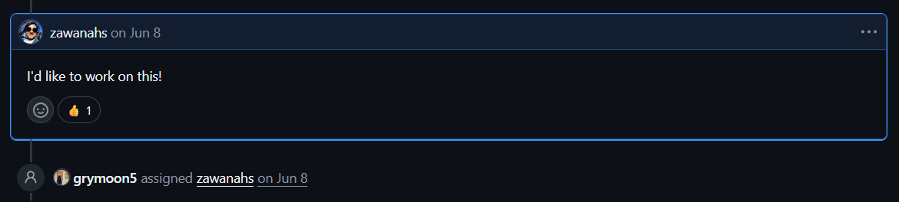
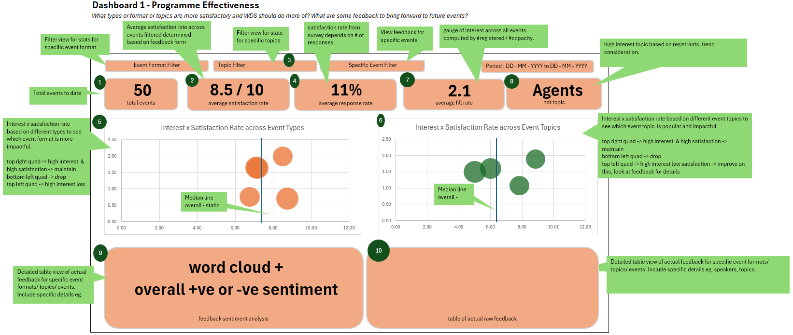
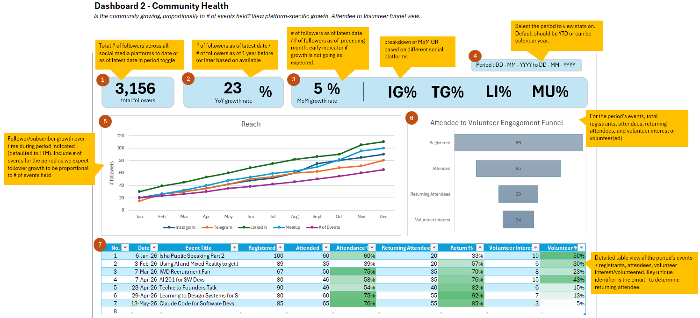
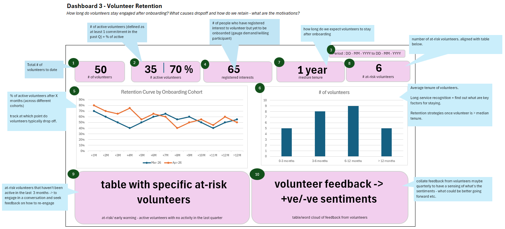

## The Few Minutes to a Yes
While chatting with the Community and Programs Lead of Women Devs SG, she asked if I was interested to work on building a dashboard for the WDS community. She shared the github issue. After I read it, it was a definite yes for me.

I was pretty excited to work on this project because it allowed me to apply my analytical skills and I get to build something tangible that would create an impact on future decisions for the community. There are 3 main areas of focus that the dashboard should serve.

First, **programme and event effectiveness**. The dashboard should answer questions like:
- "Do the attendees find our events useful?", 
- "Are there specific topics that are popular that we should plan more events around in future?", 
- "Are specific formats more popular?", or 
- "What are attendees saying about our events that we can improve on in future?". 

The goal is to provide us with more information to organise better events that serve the intended audience.

Second is **understanding the community profile**. Women Devs SG (WDS) is a community group whose mission is to support women to excel in their technical careers. The target audience are women ideally 3-5 years in their tech (or tech-adjacent) professional careers. The dashboard should answer: 
- "Are we attracting our target audience?", 
- "Are there specific profiles that are more keen in certain topics or format?", 
- "Are there specific sectors (private or public or academia etc.) that are more keen in certain events?", 
- "Are there attendees from companies that may want to partner with us?". 

The objective here is to better understand if the content of events need to be finetuned to reach more of our target audience (ie. more intentional outreach) or whether more rules or policies need to be in place to create more space for our target audience. For example, typically AI and agents-related events attract more male audiences. With a fixed capacity, while WDS is open to allies, they are encouraged to bring a woman along. 

Third is **volunteer retention**. I was part of the first batch of volunteers that were officially onboarded early this year. Before the official onboarding program was up, there were already volunteers since its inception in 2024, and amongst them, there were some who were have been very active but also others who were not. Understanding what retains volunteers and what may have caused them to drop off would help with managing the volunteers in future. The dashboard would answer questions like:
- "At which point after onboarding do volunteers typically drop off?"
- "What are key factors that retain volunteers?"
- "What are some reasons for drop offs?"
- "What are some ways to encourage long-term commitment?"

Once I've confirmed understanding of the use case of the dashboards, I proceed to mock-up the dashboard to run it by the Directors before building it.

## Dashboard Mock Ups

I've used *Figma* for process workflows and love it for UI designs. I intended to use it to mock up the dashboard. 

However, I found it clunky for this particular use case because I needed to easily render charts as part of visualising data on the dashboards, and Figma doesn't have chart plugins that are versatile enough. 

My other go-to is *Excalidraw* but it also doesn't support charts.  

I didn't want to spend too much time finding the best tool for visualising, as I simply needed to "get my vision on paper", so I went with *Excel*. 

#### Programme Effectiveness

I started with the Programme Effectiveness Dashboard mock up:

The top part of the dashboard shows KPIs or metrics that we care about when assessing how effective our events are. The top key metric I thought of was the `average satisfaction rate` based on feedback from our attendees. Including the `average response rate` is prudent and presents a more objective and honest picture where we can say that our events have high satisfaction rating of 8.5/10 but this is based on responses from 11% of our attendees. 

Throughout the year, there are certain event topics or formats that are oversubscribed due to capacity limitations and I wanted to capture this so that in future, we can cover this unmet demand by reaching out to venue sponsors that can meet this capacity or by orgnising more of such events. So I computed a metric `fill rate` as proxy for relative demand by `# registered / # capacity`. So the higher the fill rate, the more in-demand the event topic or format is. 

In a similar vein, by organising the events by topics, I also wanted to capture what is a `hot topic` based on total number of registrants for the events so we can consider organising more of such topics in future. 

The mid-section of the dashboard shows the different cuts or angles of the data that are useful and relevant for making better event decisions in future. I plot `fill rate` against `average satisfaction rate` to visualise which are events that are well received and oversubscribed so we can continue to scale them and which events are not so well received and not fully subscribed so we can deprioritise these events. This is aggregated at the topic and format level as well so we can if specific topics or formats are not as popular or could be conducted better.

The last section is an **interactive deep dive** for specific topics or formats or events, where we can see the overall sentiments based on feedback (either positive or neutral or negative) using sentiment analysis and on the right side, be able to view the actual feedback. Having an interactive option to get into real data also brings *more credibility* to the dashboard where the user can actually check that aggregated metrics are aligned with real feedback data. For example, if a specific topic has a high satisfaction rating and high fill rate, we would expect the word cloud to show an overall positive sentiment and more positive (than negative) feedback on the right.  

#### Community Health

Women Devs SG (WDS) has grown pretty fast to ~3K followers across all platforms over 2 years, and are simply seeking to continue growing organically. There are no hard KPIs/metrics to meet (like for-profit organisations) so this dashboard is meant to be a monitoring tool to ensure that the community is growing as we continue to organise events.

I started with the `total number of followers`, followed by a breakdown of the `growth rate across the different platforms` so we could see if there is a need to optimise for reach for specific platforms.

When I presented this dashboard to one of the Directors and asked about the goal of WDS with respect to the target audience and attendees, she said she's happy as long as there are returning attendees because it is an indication that WDS continues to provide value through events organised. So `return %` is an important metric to have on the dashboard. 

At the same time, it was not expected that returning attendees register interest as volunteers as the goals of an attendee would differ from the goals of a volunteer, so the funnel should exclude volunteer interest %. Volunteer interest and other volunteer-related metrics could be captured in the volunteer retention dashboard instead.

After some discussions with the Directors, I learnt that while this is a good monitoring tool for community health, it may not be as critical because:
- the numbers are not required at a monthly cadence, but rather, when partnerships deck are needed and when doing a retro at year-end. 
- the goal is sustainable growth so as long as the WDS community is growing, all is well

I appreciated this conversation because it highlights some key differences of the priorities of a for-profit and a non-profit organisation. 

Coming from a corporate background, the decisions made would be the opposite. For example, in corporate, there will be an annual growth rate % target (even quarterly and monthly growth rate %) and this is a number we need to beat the following year, and we must think of innovative ways to do it. Having it at a more regular cadence helps us see if we are closer or further away from the target and be able to make the necessary changes or apply new strategies to get closer to the target and maybe beat it by year end. Well it sounds pretty exhilirating but at the same time, can be anxiety-inducing as well. 

Anyway, so instead of growth rate, what would be more interesting is looking at the `attendee profile` for the events organised to learn more about the kind of individuals that the events are attracting. For example, the gender-mix for specific event topics, the seniority of the attendees, and the sector (private, public or academia etc.) of the organisation that the attendee is an employee of. This could help to market the events to the subgroup of target audience better or a change in the kind of content in events to attract more of our target audience.

The dashboard needs a pretty substantial makeover, and a new data source to pull in attendee details. 

#### Volunteer Retention

Similarly, my volunteer retention dashboard mock up had some key metrics optimising for volunteer activity here, but this was not the priority and focus for a non-profit community group like WDS. Specifically, the dashboard calls out `"at-risk" volunteers (defined by inactivity of over 3 months) and names them for the leads to have a conversation with them to understand the lack of active contribution. 

After a discussion with the Directors, they found this metric and focus to be harsh because there are many other valid reasons for a lull period for volunteering, especially so for mid-career women volunteers. Again, I reminded myself that this is not a corporate setting where you are paid for your contributions. 

Instead, the focus is to **understand the goals of women who have registered an interest to volunteer, and for WDS to be the platform that provides opportunities for them to achieve their respective goals**. 

Other key metrics and information in the mock up that would be useful is looking at the `% active volunteers` so we can see if we need to onboard more volunteers and more importantly, the `volunteer feedback` which provides clear information of how best to engage and support the volunteers in achieving their goals with WDS.

---

Mockups are important artifacts for end-users (in this case the Directors of WDS) to have an idea of how the dashboard looks like for their use. Seeing as how some of my dashboards mock up require some heavy makeovers, I can't impress the importance of a conversation with the stakeholders enough! 

I've learnt more about the priorities of a non-profit, and appreciate the Directors' time and feedback, and this opportunity. 

Before I end Part 1, the keen eye might recognise that I designed my dashboards to follow key design principles of building an effective dashboard. It follows the [inverted pyramid design](https://help.salesforce.com/s/articleView?id=analytics.bi_dashboard_visual_hierarchy.htm&type=5): the most important metrics first, supporting charts next, followed by detailed tables or information at the bottom.

Next, I share about planning the data pipelines that feed into the dashboard in Part 2.

