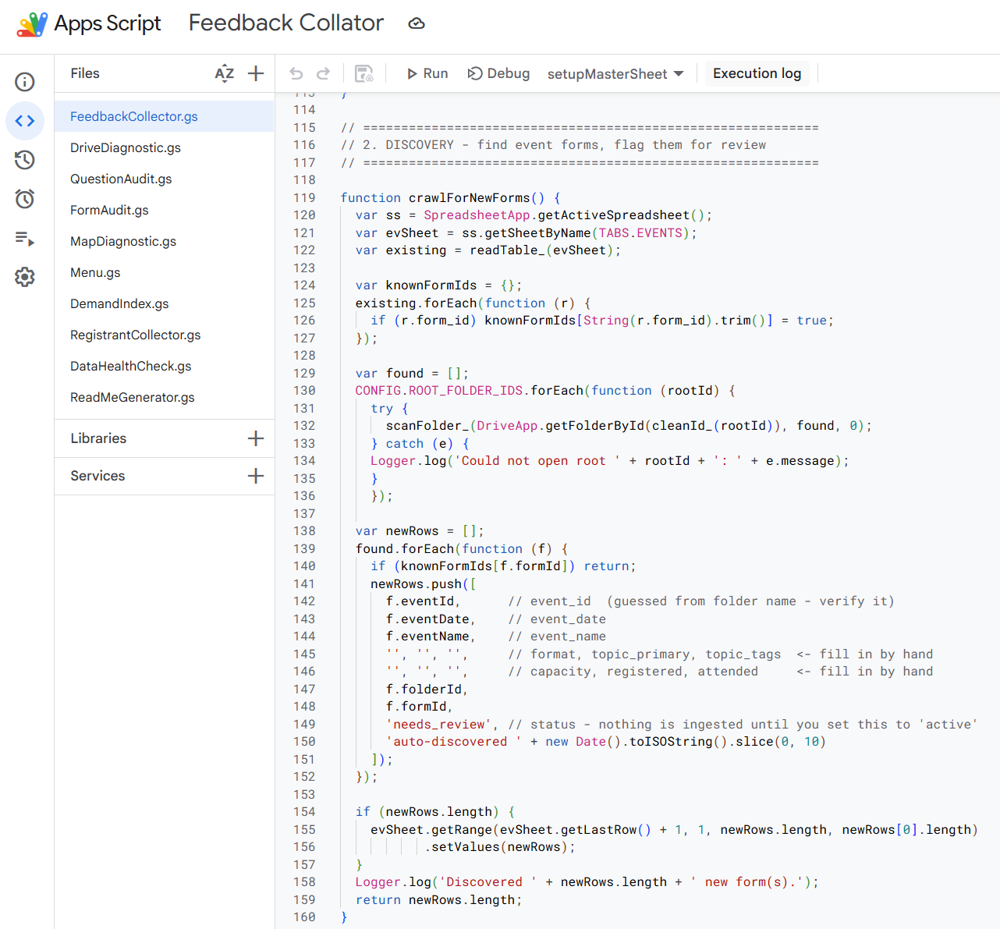
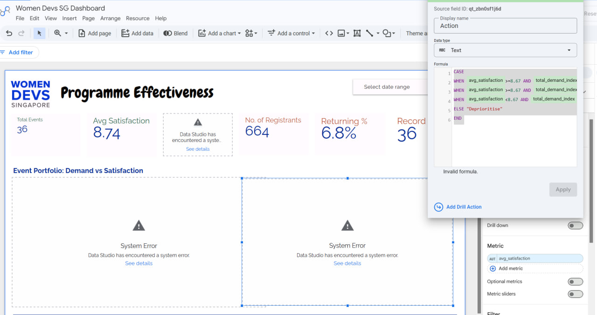

This is a continuation of [Part 1](https://zawanah.com/articles/wds-analytics-dashboard-part-1/) where I share the process of building an analytics dashboard for Women Devs SG. 

For this part of the series, I will share about building the data pipelines that will feed this dashboard and challenges and limitations while building.

## Data Pipeline

There are 2 key considerations when I planning the data architecture and flow into the dashboard:

**1. Data sources** - Where does the data live now? Is there a need for data migration to a central place that feeds into the dashboard? Will there be data cleansing or transformation needed and where is best to perform these? 

The data lives in Google Drive, and each event has its own folder that contains the registrations, attendance and feedback responses in Google Sheets or Google Form responses. 

Since most of the data live in Google Sheets, I decided to create a Master Google Sheet containing all the data that I need, which will then be sanitised (to exclude personally identifiable information), before being fed into the dashboarding tool. 

I had thought of a more future proof solution by having all future events have the registrations and attendance data in one sheet, but this would require a significant change in the existing processes and I prefer to minimise significant changes to current processes until the dashboard has earned a more permanent place here. 

To create the Master sheet, I worked with Claude and Codex to generate the codes in JavaScript to first identify all event folders, and subsequently scrape all feedback data into google sheets.

**2. Which dashboarding tool** - PowerBI or Tableau or Data Studio...

I am familiar with Power BI and Tableau, but since this dashboard is meant to be accessible to leads of WDS, they need to be able to access it easily and if I built the dashboard with my account, it would be stuck with me. Not to mention you need a PowerBI and Tableau licence to view it. 

So I researched, and the next best option was Data Studio (formerly known as Looker Studio). Since it is also a Google product, it would be seamless to feed data from the Master Google Sheet to Data Studio. 

Now that the data is ready and the tool is decided on, off I go to build it.

## Challenges and Limitations

I was pretty confident of building the dashboard since I already have the vision (and mock ups) for how the end product should look like and how it is to be used, and tooling is just something new I could pick up on.

However, I found myself spending a significant portion of my time working around the limitations of Data Studio.

Specifically in these areas:
- Aggregation rules in calculated fields. When applying a formula using `CASE WHEN`, an aggregated field cannot be mixed with non-aggregated fields. Every aggregate recalculates relative to its current context, so there is no way to compare the `average satisfaction rate` of an event, against the `median satisfaction rate` for the year. Wrapping an aggregate in its own separate field doesn't work either. The only way was to hardcode the `median satisfaction rate` for the year in the formula, and this is not ideal
- Chart coloring by topic and format, and toggling between the two is not straightforward and the only way was to build separate charts for each
- Formatting involves adjusting the size of the chart or card and also changing the font size so it fits in the card. A change in size for one chart, would ripple into massive changes on surrounding charts.
- AI summary feature which would be perfect for summarising feedback for a particular topic or format or event was not available on the free-tier build.

It took me a day and some to configure workarounds, until I realised that time should be spent on more important and value-added endeavours, than administrative workarounds. 

So I made a decision to move away from Data Studio.
 
And instead, I fable-d the dashboard. And it was a breeze!

The experience made me come close to concluding that there is no future for old dashboarding tools if I could take just half a day to produce the dashboard with Claude Code, and to build it straight from my vision!

Final build details in Part 3.