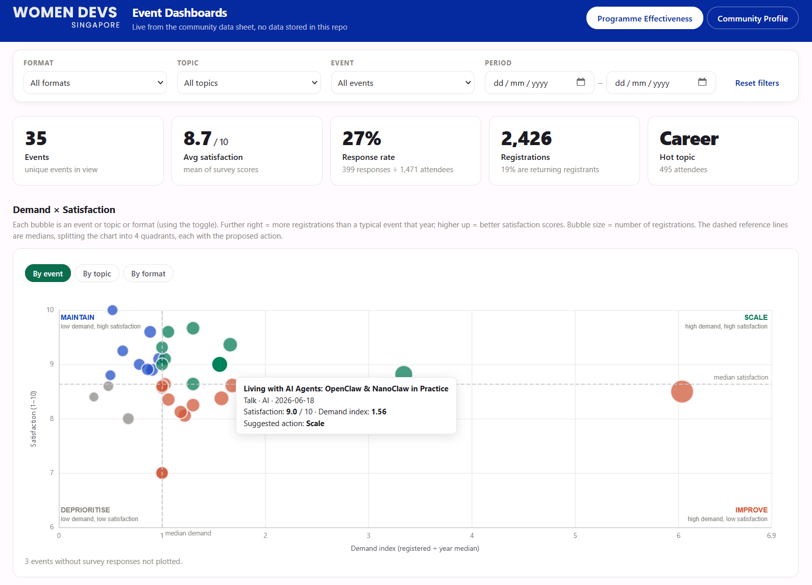

This is a continuation from [Part 2](https://zawanah.com/articles/wds-analytics-dashboard-part-2/) where I share the process of building an analytics dashboard for Women Devs SG. 

For this part of the series, I share V1 of the dashboard, built with Claude's Fable 5 model. 

