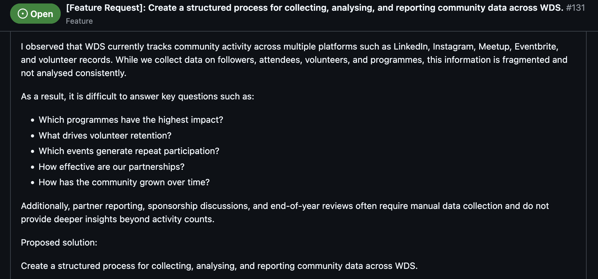

## context
While chatting with a fellow volunteer of Women Devs SG, I was interested to work on building an analytics dashboard for the WDS community. 

“I’d like to work on this!” I commented. Soon after, the issue was assigned to me.

It was a simple exchange, but it marked the beginning of a project that brought together two things I cared about: using my experience as an analyst and contributing to a community that supports women in their technical careers.

As a volunteer with Women Devs SG, I saw an opportunity to build more than a collection of charts. The dashboard could help the directors better understand who attends our events, identify the topics and formats that resonate with the community, and plan more intentional outreach. For me, the project also became an exploration of how analytics can support a growing technical community—from asking the right questions to turning its data into decisions.

issue 
requirements

streamlining requirements into dashboard mock -> show my mockups

presenting to director, and all is okay. 

### planning data pipeline. 
considerations: 
- data sources, g sheet. considered api for meetup for registrations and attendees data but decided on using what is available first, also need to consider the frequency of use ofthe dashboard eg. if we are only revisiting the dashabord for decisions every 6 months, we don't ahve to use an api that gets live registration or attendee data as soon as available. 
- tools; data studio, powerbi, tableau. since the data source is sporadic in google sheets. it's easier to have the dashboard on a tool with easy integration. based on research, looker studio, so decided to go with this. 

### Streamlining the data across all event folders in WDS google folder. 
- apps script; some kinks eg. feedback form with just the g sheet and not the google forms. 

Minimise changing existing processes too much, so decided to use a script that extracts all the g forms data across all events and consolidate it into a master file. 

Considering PII, have to place the sanitised data in a separate google sheet, that looker studio takes from. 

### Building the dashboard 

back and forth with looker studio. 
pros: very easy to source directly from google sheets
cons: data calc limitations

found myself spending more time configuring the dashboard to calculate the field that i want and configuring the dashboard visuals to how i wanted it. 

waste of my time, and my brain is dying at each administrative workarounds i did. 

so i fabled it. 

in half a day i got the dashboard up.

